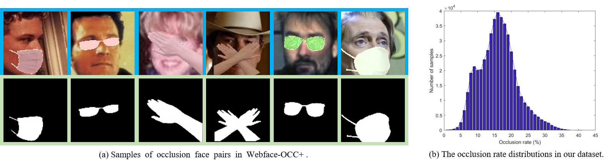

# When Face Recognition Meets Occlusion: A New Benchmark (Webface-OCC)
By Baojin Huang, Zhongyuan Wang, Guangcheng Wang, Kui Jiang,Kangli Zeng, Zhen Han, Xin Tian, Yuhong Yang

## Introduction

 **Webface-OCC** is a simulated occlusion face recognition dataset, covering 804,704 face images of 10,575 subjects.

<div align=center>
	 
</div>

**Webface-OCC+** is an upgraded occlusion face dataset by further encompassing challenging body occlusion types and annotated mask labels on the basis of
our previous Webface-OCC.

<div align=center>
	 
</div>

## Data & Pretrained Model Download

**Request the download link from** huangbaojin@whu.edu.cn **(academic only)**.

## Occlusion Face Recognition
### Model Training

1. Install `MXNet` with GPU support.

```
pip install mxnet-cu100 # mxnet-cu102
```
2. Train occlusion face recognition models.
In this part, we assume you are in the directory *`$ROOT/ArcFace_occ`*.

```
CUDA_VISIBLE_DEVICES='0,1' python -u train.py --network r50 --loss cosface --dataset emore
```

## Citation

If you find Webface-OCC useful in your research, please consider to cite the following paper:

```
@inproceedings{huang2021when,
  title={When Face Recognition Meets Occlusion: A New Benchmark},
  author={Baojin Huang, Zhongyuan Wang, Guangcheng Wang, Kui Jiang, Kangli Zeng, Zhen Han, Xin Tian, Yuhong Yang},
  booktitle={ICASSP},
  year={2021}
}
```

```
@article{huang2022joint,
  title={Joint segmentation and identification feature learning for occlusion face recognition},
  author={Huang, Baojin and Wang, Zhongyuan and Jiang, Kui and Zou, Qin and Tian, Xin and Lu, Tao and Han, Zhen},
  journal={IEEE Transactions on Neural Networks and Learning Systems},
  volume={34},
  number={12},
  pages={10875--10888},
  year={2022},
  publisher={IEEE}
}
```

## Contact

huangbaojin@whu.edu.cn
