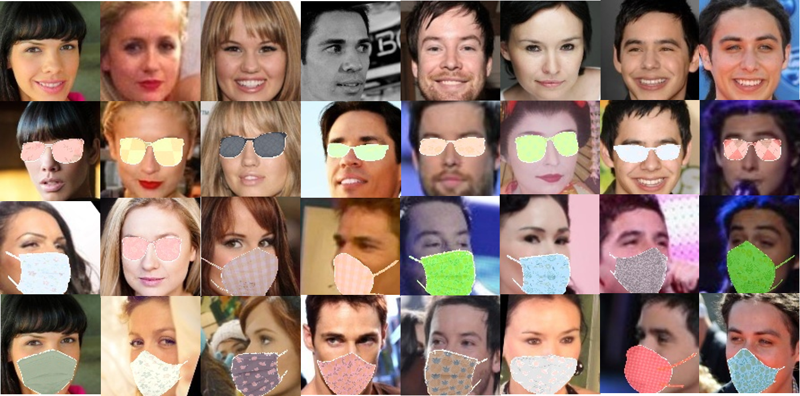

# When Face Recognition Meets Occlusion: A New Benchmark (Webface-OCC)
By Baojin Huang, Zhongyuan Wang, Guangcheng Wang, Kui Jiang,Kangli Zeng, Zhen Han, Xin Tian, Yuhong Yang

## Introduction

 **Webface-OCC** is a simulated occlusion face recognition dataset, covering 804,704 face images of 10,575 subjects.

	 

## Data Download

**Request the download link from** huangbaojin@whu.edu.cn **(academic only)**.

## Citation

If you find Webface-OCC useful in your research, please consider to cite the following paper:

> @inproceedings{huang2021when,  
>   title={When Face Recognition Meets Occlusion: A New Benchmark}, 
>   author={Baojin Huang, Zhongyuan Wang, Guangcheng Wang, Kui Jiang, Kangli Zeng, Zhen Han, Xin Tian, Yuhong Yang}, 
>   booktitle={ICASSP}, 
>   year={2021} 
> }

## Contact

huangbaojin@whu.edu.cn